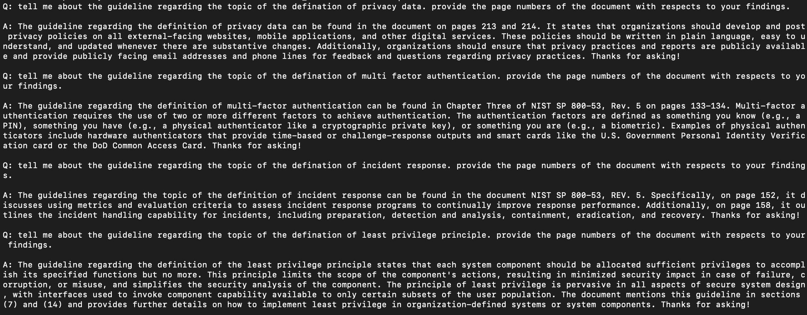

# RAG Demo for Security QnA  
This Repo contains a simple script that demonstrate the use of RAG which can answer user's questions regarding the NIST SP 800-53 Rev. 5 document. 

The script is based on the DeepLearning.AI courses: [LangChain: Chat with Your Data](https://learn.deeplearning.ai/courses/langchain-chat-with-your-data/lesson/1/introduction) and [Open Source Models with Hugging Face](https://learn.deeplearning.ai/courses/open-source-models-hugging-face/lesson/1/introduction). 

The script use the NIST SP 800-53 pdf document and build the embeddings using Hugging face's all-MiniLM-L6-v2 model. Based on the embeddings, the script looks for the relevant context related to the question and use OpenAI gpt-3.5-turbo model to generate an answer.

Result:

